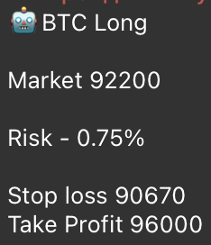
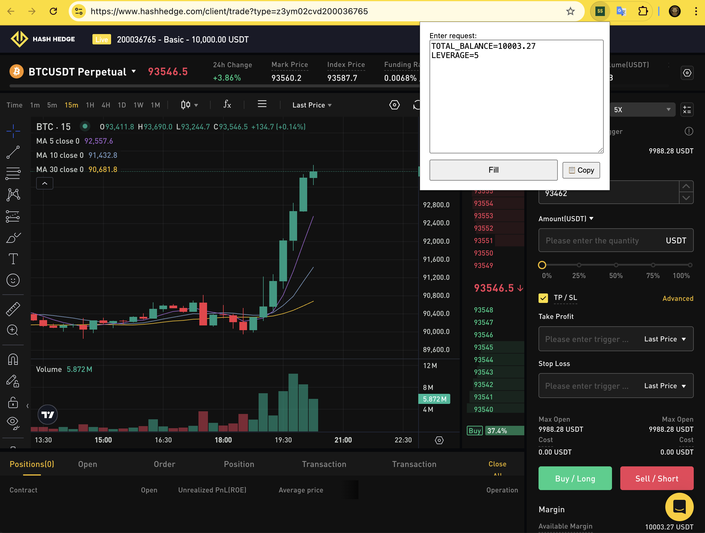
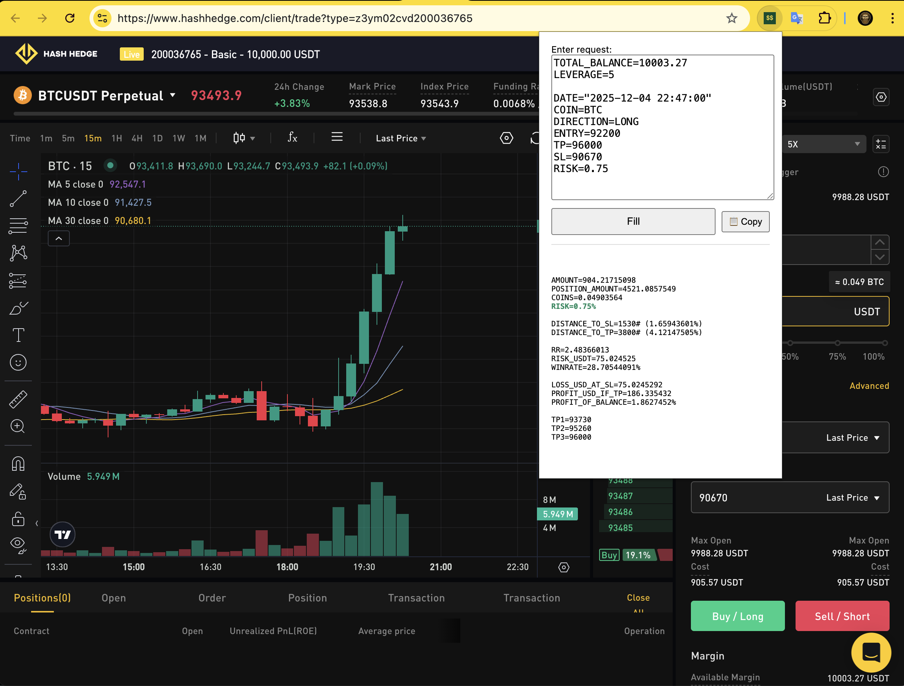

# tx10-signal-executor

[➡️ Installation](#-installation) • [📌 Usage](#-usage-guide) • [🐛 Issues](#-support--bugs)

Chrome Extension that parses trading signals (ENTRY/SL/TP/RISK), calculates position size and TP levels, and automatically fills the order form on supported prop‑trading platforms (HashHedge & BitFunded).

---

## 🚀 Installation

You can install the extension in two ways:

### 🔹 A) For Developers (Git)

If you know how to use git — this is the recommended way:

```bash
git clone https://github.com/teamx10/tx10-signal-executor
cd tx10-signal-executor
```

1. Open Chrome and go to: `chrome://extensions/`
2. Enable **Developer mode** (top right)
3. Click **Load unpacked**
4. Select the folder of the repository
5. Pin the extension to the toolbar (click the puzzle icon → pin)

### 🔹 B) For Non‑Developers (Releases)

If you don’t use git:

1. Download the latest `.zip` archive here:  
https://github.com/teamx10/tx10-signal-executor/releases
2. Unzip the archive
3. Open Chrome → `chrome://extensions/`
4. Enable **Developer mode**
5. Click **Load unpacked**
6. Select the unzipped folder
7. Pin the extension to the toolbar

---

## 📌 Usage Guide

### 0️⃣ Use AI to extract the signal data

Train ChatGPT (or any AI) to read screenshots and convert them to text.

Example:

Screenshot → AI →

```
COIN=BTC
DIRECTION=LONG
ENTRY=92200
TP=96000
SL=90670
RISK=0.75
```

### 1️⃣ Make a screenshot of the Telegram signal



### 2️⃣ Convert screenshot → text

Use ChatGPT, Claude, Gemini or any OCR tool.

### 3️⃣ Copy the extracted text

### 4️⃣ Open trading page

Supported platforms:

- https://www.hashhedge.com/client/trade
- https://trader.bitfunded.com/client/trade

### 5️⃣ Check selected coin

Example: BTCUSDT Perpetual

### 6️⃣ Open the extension



Pin the extension to Chrome toolbar to make it always visible.

### 7️⃣ Verify auto‑detected balance & leverage

The extension extracts your balance and leverage from the page automatically.

Example:

```
TOTAL_BALANCE=10003.27
LEVERAGE=5
```

Make sure the values match your current trading account.

### 8️⃣ Paste the signal data

Paste text from AI into the field.

### 9️⃣ Click **Fill** and verify

The extension will:

- calculate position size
- calculate RR and winrate proxy
- calculate TP1/2/3
- auto‑fill the order form fields



Verify all fields before trading.

### 🔟 Place your order 🎯

Once everything is correct — place the order.

---

## 🧠 Example Signal

```
TOTAL_BALANCE=10003.27
LEVERAGE=5
ENTRY=92200
TP=96000
SL=90670
RISK=0.75
DIRECTION=LONG
```

---

## 🛠️ Development

Make changes locally and reload extension in Chrome.

---

## 🐛 Support & Bugs

If you find bugs — please:

1. Create an issue here:  
https://github.com/teamx10/tx10-signal-executor/issues

or

2. Write directly to me on Telegram: **@sharkich**

Feedback and ideas are welcome 🤝

---

## 📜 License

MIT
